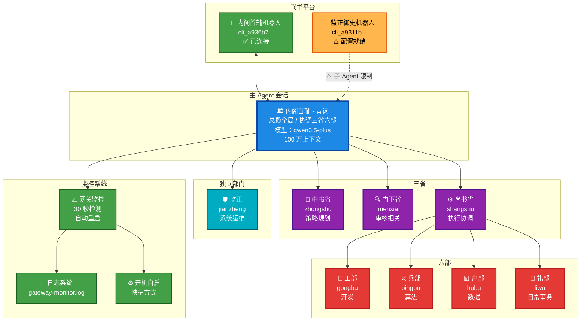
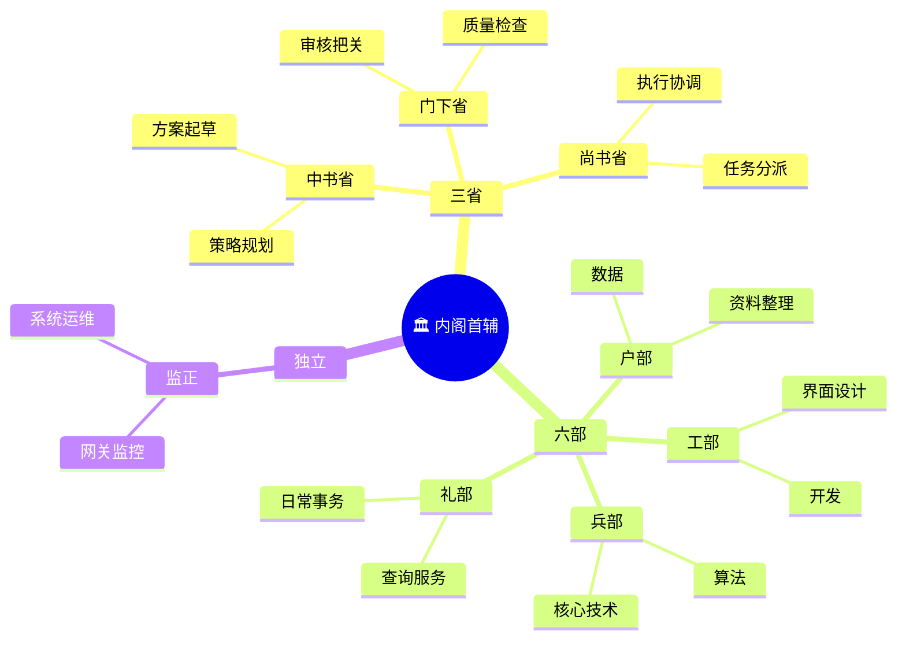
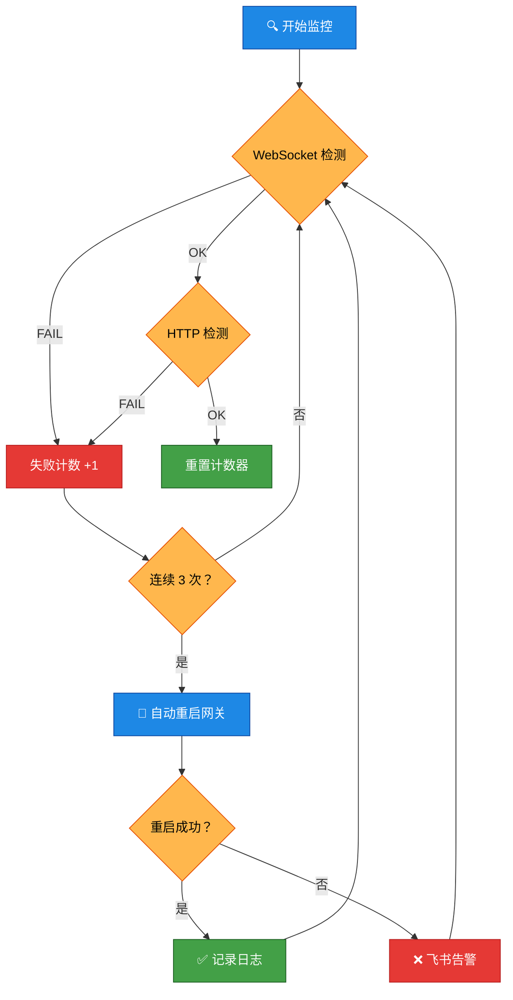

# 🏛️ OpenClaw 系统架构图

**绘制时间：** 2026-03-20  
**版本：** v1.0

---

## 整体架构



---

## 数据流

```mermaid
sequenceDiagram
    participant 陛下
    participant 飞书
    participant 内阁首辅
    participant 子 Agent
    participant 网关

    陛下->>飞书：发送消息
    飞书->>内阁首辅：转发消息
    内阁首辅->>内阁首辅：分析需求
    alt 简单任务
        内阁首辅->>子 Agent: 分派任务
        子 Agent->>子 Agent: 执行
        子 Agent-->>内阁首辅：返回结果
        内阁首辅->>飞书：发送回复
        飞书->>陛下：显示消息
    else 复杂任务
        内阁首辅->>子 Agent: 分派给多部协作
        子 Agent->>子 Agent: 协作执行
        子 Agent-->>内阁首辅：返回结果
        内阁首辅->>飞书：发送回复
        飞书->>陛下：显示消息
    end

    Note over 内阁首辅，网关：网关监控并行运行
    网关监控->>网关：每 30 秒检测
    alt 网关正常
        网关-->>网关监控：响应 OK
    else 网关断连
        网关监控->>网关：自动重启
        网关监控->>飞书：发送告警
    end
```

---

## Agent 职责



---

## 网关监控流程



---

## 配置状态

```mermaid
quadrantChart
    title 配置完成度
    x-axis 未完成 --> 已完成
    y-axis 不重要 --> 重要
    quadrant-1 优先完成
    quadrant-2 保持现状
    quadrant-3 可选优化
    quadrant-4 低优先级
    网关运行：[0.95, 0.95]
    内阁首辅飞书：[0.95, 0.9]
    网关监控：[0.9, 0.85]
    开机自启：[0.85, 0.7]
    9 个 Agent: [0.9, 0.8]
    监正配置：[0.7, 0.6]
    监正飞书配对：[0.3, 0.5]
```

---

## 关键指标

| 指标 | 数值 | 状态 |
|------|------|------|
| Agent 总数 | 9 个 | ✅ |
| 飞书账号 | 2 个 | ✅ |
| 网关端口 | 18789 | ✅ |
| 监控间隔 | 30 秒 | ✅ |
| 失败阈值 | 3 次 | ✅ |
| 重启重试 | 3 次 | ✅ |
| 日志文件 | 2 个 | ✅ |

---

**🏛️ 内阁首辅 - 青词 呈**
